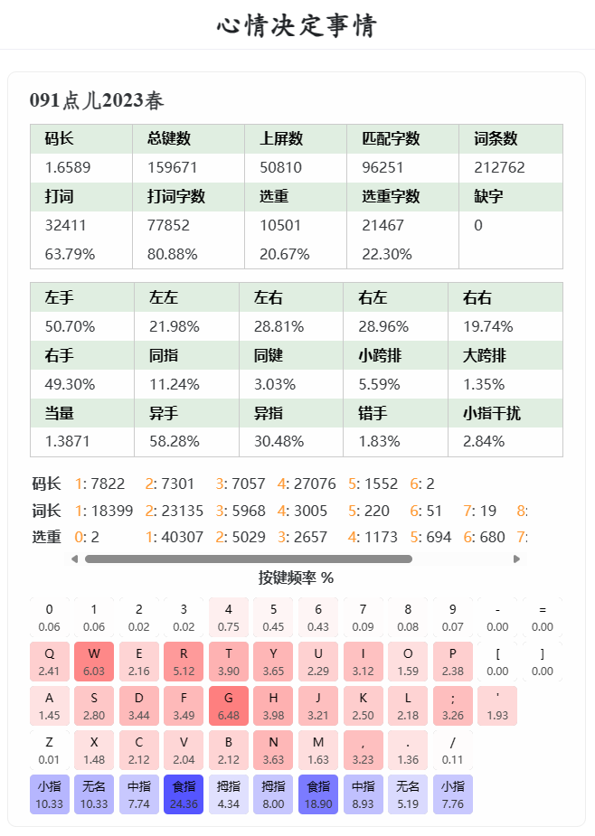

# go 语言写的赛码器

只是一个包，具体实现请看

- <https://github.com/cxcn/gosmq/tree/main/cmd/client>
- <https://github.com/cxcn/gosmq/tree/main/cmd/server>

## 码表

码表顺序和匹配顺序无关（最长顺序匹配）  
词条有重复时取前者

### rime 格式的码表

只支持编码在后的格式  
必须指定 `SmqIn.BeginPush` 字段（起顶码长，码长大于等于此数，首选不会追加空格 `_`）

```
# Rime dictionary
# encoding: utf-8
#

---
name: xcxb
version: "1.0"
sort: original
...

人	a
如果	a
瑞	aa
睿	aaa
仍然是	aad
瑞士	aadi
...
```

`-d=4` 转换结果

```
人	a_
如果	a2
瑞	aa_
睿	aaa_
仍然是	aad_
瑞士	aadi
```

### 极速赛码器格式

```
工	a_
花	a2
華	a3
式	aa_
区区	aa2
工艺	aa3
恭恭敬敬	aaaa
花花草草	aaaa2
```

## 手感

可选:  
`SmqIn.IsSpaceDiffHand` 空格是否互击  
`SmqIn.SelectKeys` 自定义选重键(2 重开始)
将编码中末尾数字替换，只支持 10 重以内

## 输出 html

`NewHTML()` 创建一个对象

`.AddResult(*smq.SmqOut)` 添加一个结果

`.OutputHTML(io.Writer)` 输出 html 到 io 流

`.OutputHTMLFile(string)` 输出 html 到文件

### 例子

```go
si := new(smq.SmqIn)
h := smq.NewHTML("文本名")
so,err := si.Smq()
if err != nil {
    panic(err)
}
h.AddResult(so,"码表名")
h.OutputHTMLFile("result.html")
```

### 预览



## Benchmark

> 配置：windows 10, r5 3600 4.2g, 8g\*2 2933Mhz c18

| 文本         | 文本字数 |             码表 | 码表词条数 |  耗时 |
| ------------ | -------: | ---------------: | ---------- | ----: |
| 心情决定事情 |     9.6w | 091 点儿 2021 夏 | 20w        | 120ms |
| 红楼梦原著   |      87w | 091 点儿 2021 夏 | 20w        | 250ms |
| 极品全能高手 |    2164w | 091 点儿 2021 夏 | 20w        |  3.8s |
| 极品全能高手 |    2164w |   红辣椒五笔码表 | 880w       | 12.6s |
| 心情决定事情 |     9.6w |   红辣椒五笔码表 | 880w       |  6.7s |
